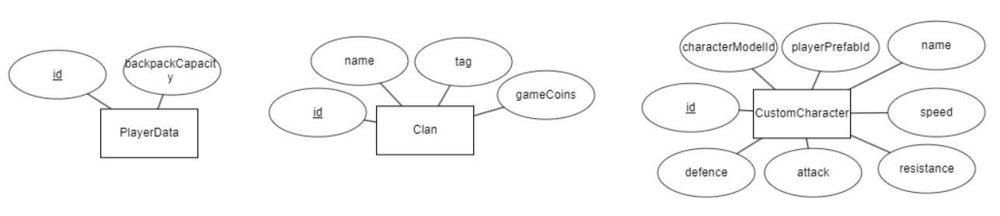
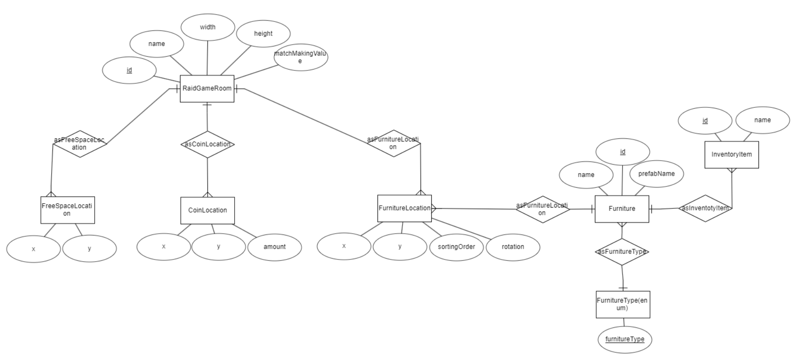
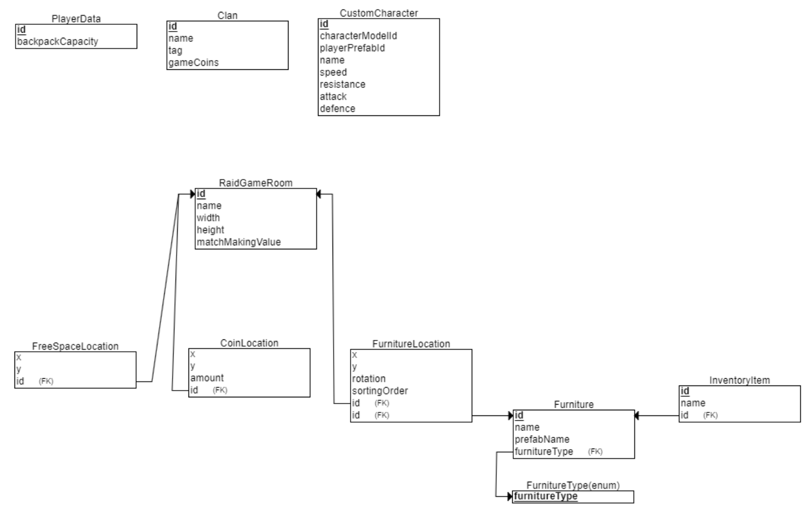

# Altzone-Server

This is a REST API for Altzone game

## Getting started

### Install software to run the API
1. You have to install Node.js version 18 to your computer. The installation process is similar to installing a regular program. 
You may download it here: [https://nodejs.org/en/download](https://nodejs.org/en/download). For Windows choose the LTS .msi 64-bit version.
2. Install MongoDB Community Server: [https://www.mongodb.com/try/download/community](https://www.mongodb.com/try/download/community)
3. After that go to the folder where you have saved the project and run ```npm install``` in the terminal

### Create .env file
Create .env file in the root directory.

Here is example values (avoid spaces):

PORT=8080
MONGO_URL=mongodb://127.0.0.1
MONGO_PORT=27017
MONGO_DB_NAME=altzone

### Start the API
In order to start the API, you need to run the following commands in the terminal(project root repository):
1. ```tsc -w```
2. ```node dist/index.js```

The API will start at http://localhost:8080 by default.

Do not forget to terminate processes in the end (both tsc and node) by pressing Ctrl+C in terminal.

*Currently, the API is only available to run in development mode

## API Schema






