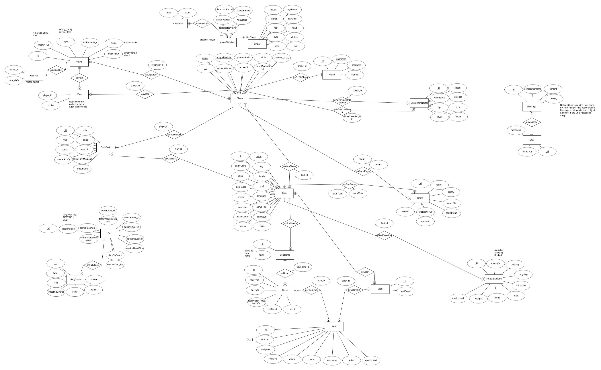

# Altzone-Server

This is a REST API for the Altzone game. For more detailed API description and additional instructions see the [wiki pages](https://github.com/Alt-Org/Altzone-Server/wiki).


## API versions

Production https://altzone.fi/api (prod branch)
Latest release https://devapi.altzone.fi/latest-release (main branch)
Dev https://devapi.altzone.fi (dev branch)


## Swagger description

1. [Swagger on web](https://devapi.altzone.fi/swagger)
2. [Download latest swagger file version](https://devapi.altzone.fi/swagger-json)


## Getting started

### Install required software

1. Install Node and npm, choose your platform and node version, which should be LTS [here](https://nodejs.org/en/download).
2. Install docker. Instructions can be [found here](https://docs.docker.com/engine/install/).
3. Clone the API repo from GitHub https://github.com/Alt-Org/Altzone-Server.git.
4. Open a cloned repo in the IDE and install required dependencies with.
   ```shell
   npm install
   ```

### Start required services

1. First, you need to set up the DB. So please run a script for it from the project root folder:

   For Windows (PowerShell):
   ```shell
    powershell -ExecutionPolicy Bypass -File .\init-db-on-windows.ps1
   ```
   
   For Linux (Bash):
   ```shell
    bash ./init-db-on-linux.sh
   ```

2. Then start MongoDB, Redis and Mosquitto docker services (it will take couple minutes for the first time) 
   ```shell 
   docker compose up
   ```

### Start the API

Start the API in dev (watch) mode by running the command in terminal
```shell
npm run start:dev
``` 

Above command will compile TS to JS and create a dist folder with compiled code. This folder should not be removed.

The API will be accessible on your machine on http://localhost:8080/

### Stop API and DB

1. Stop API by pressing Ctrl+C with focused terminal
2. Stop DB and all other Docker services by pressing Ctrl+C (couple times to force) and run
   ```shell
   docker compose down
   ```


## DB Schema




## API architecture schema


